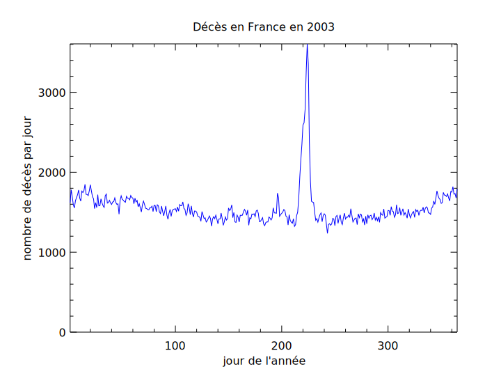
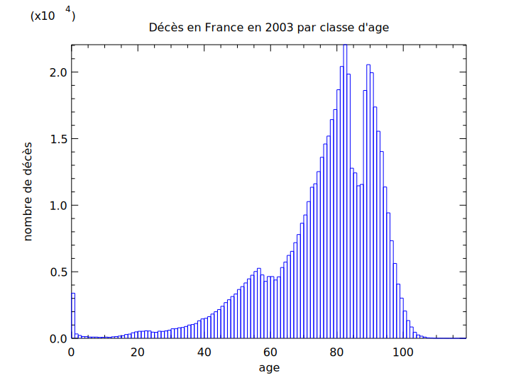

# Décès en France

[English version](README.en.md)

Ce dépot contient un programme permettant de tracer des données à partir du [fichier INSEE des personnes décédées](https://www.data.gouv.fr/fr/datasets/fichier-des-personnes-decedees/#_).

## Dépendences

Ce programme en ligne de commande pour Linux utilise la bibliothèque de tracé [PlPlot](http://plplot.sourceforge.net/index.php).
PlPlot doit être compilée avec le support du svg car les sorties sont dans ce format.

[zlib](https://www.zlib.net) est utilisé pour lire les données dans des fichiers compressés.

La compilation du programme nécessite les outils `gcc` et `make`.

Les fichiers de données (à télécharger sur le site data.gouv.fr) doivent être dans le répertoire `data`.

## Génération des graphiques

Par défaut, les graphiques produits concernent l'année 2003. Pour tracer les données d'une année différente, téléchargez le fichier de cette année dans le répertoire `data` et modifiez les constantes dans le fichier `plotYearsData.c`.

Ensuite, il suffit de taper la commande :

    $ make

## Sorties

## Licence

Ce programme est un logiciel libre sous licence MIT. Lire le fichier [LICENSE](LICENSE) (en anglais) pour plus d'informations.
